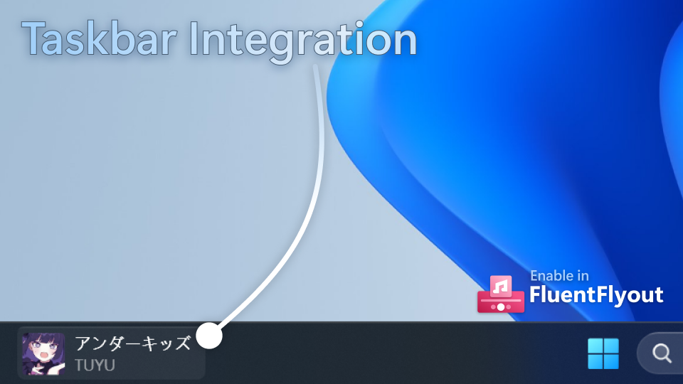
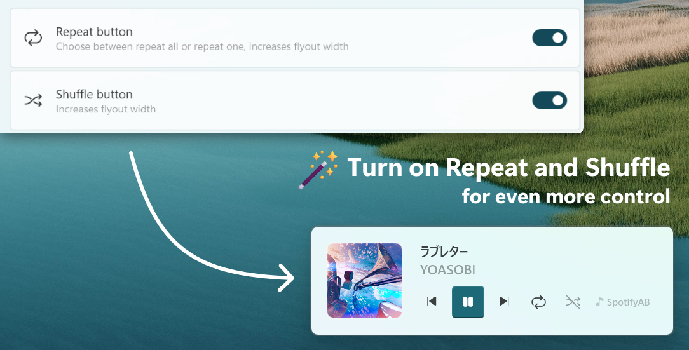
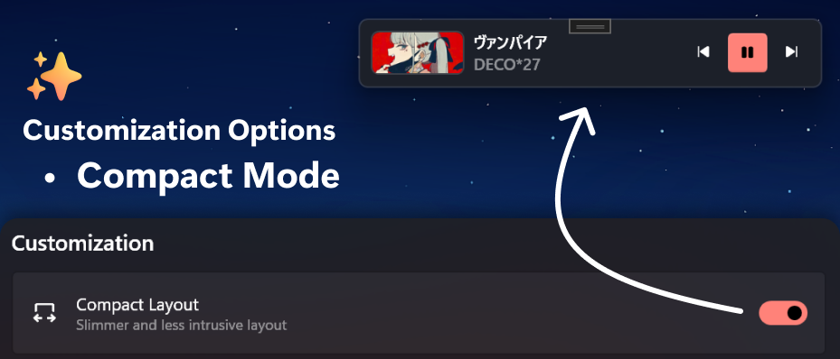
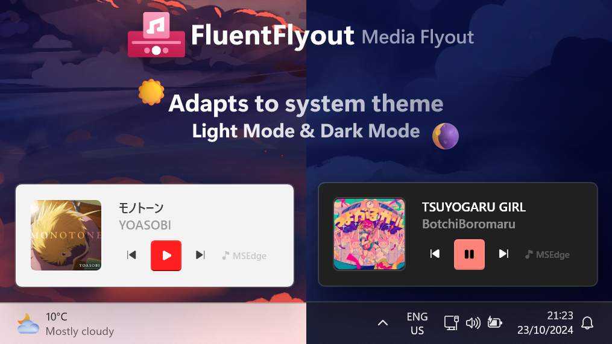
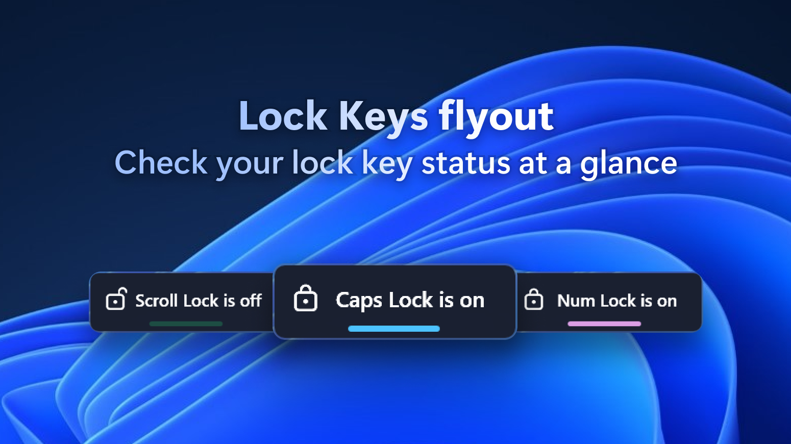
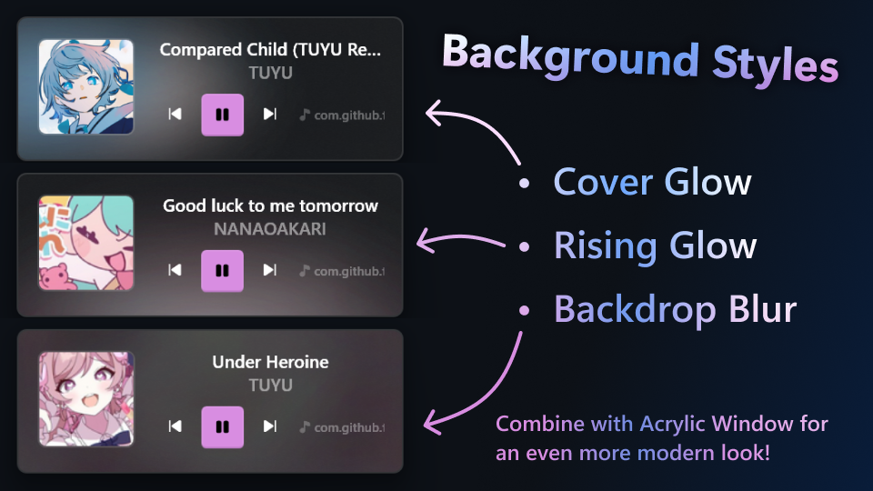
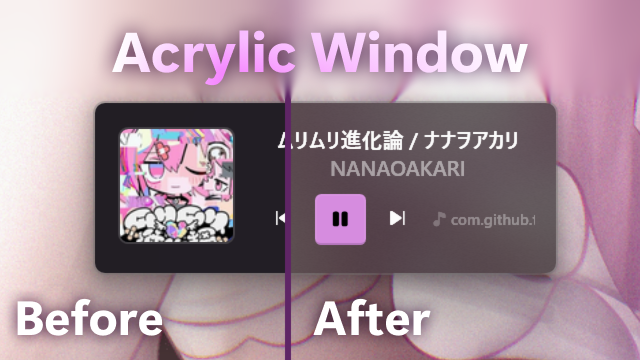

<p align="center">
	<picture>
		<source width="65%" alt="fluentflyout-title" media="(prefers-color-scheme: dark)" srcset="./assets/img1.png" />
		<source width="65%" alt="fluentflyout-title" media="(prefers-color-scheme: light)" srcset="./assets/img2.png" />
		
	</picture>
</p>

<p align="center">
  
  
  
  
</p>


---
FluentFlyout（增强版）是[unchihugo/FluentFlyout](https://github.com/unchihugo/FluentFlyout)的**优化分支**，本版本**发现并修复**了原版的**诸多bug**，原版bug详见[代码分析报告.md](./代码分析报告.md) 修复日志详见[修复实施记录.md](./修复实施记录.md)

FluentFlyout 是一个简单且现代的 Windows 音量控制弹窗，基于 Fluent 2 设计原则构建。它的用户界面与 Windows 10/11 无缝融合，为您提供一个无缝、干净、原生般的媒体控制体验。  

FluentFlyout 能够在一个雅观的现代化的弹窗中显示媒体控制和信息，同时与系统的颜色主题相融合，具有流畅的动画效果，还提供多种布局位置和更多个性化设置。

[](https://github.com/Zerin-emm/FluentFlyout/releases/latest)


## 功能 ✨
- **音乐弹窗：显示封面、标题、艺术家和媒体控制**
- **“即将播放”弹窗：在歌曲结束时显示下一首曲目**
- **锁定键弹窗：一目了然地显示锁定键的状态**
- **任务栏小组件：直接在 Windows 任务栏上显示媒体信息**
- 原生 Windows 风格设计
- 使用 Fluent 2 组件
- 采用 Windows Mica 模糊效果
- 支持深浅色模式的切换
- 与设备主题颜色匹配
- 流畅的动画效果
- 可自定义的弹窗位置
- 包含“列表循环”、“单曲循环”和“随机播放”功能
- 同时监听音量和媒体输入
- 安静地驻留在系统托盘

## 任务栏小组件 ⏯️
<div align="center">
	
</div>

<details close>
<summary>视频展示</summary>

https://github.com/user-attachments/assets/bfc7666f-1d59-4cbf-8d15-3855671cb147

</details>

## 音乐弹窗 🎵
<div align="center">
	  	  
</div>
<details open>
<summary>v2.0 截图</summary>
<div align="center">
	 
</div>
</details>

## 怎么下载？
### 安装选项

[](https://github.com/Zerin-emm/FluentFlyout/releases/latest)

下载**Innosetup**安装包

**ARM64**设备 请选择FluentFlyout-Setup-x.x.x-arm64.exe格式的安装包

**AMD64**设备 请选择FluentFlyout-Setup-x.x.x-x64.exe格式安装包

> 在寻找 FluentFlyout 设置吗？点击系统托盘图标来访问设置。

### 问题
- Windows 10 界面可能无法如预期显示

## 编译与运行 🛠️

### 前置条件
- Windows 11 或 Windows 10 (22000+)
- [.NET SDK 10.0](https://dotnet.microsoft.com/download)

### 编译项目
```powershell
dotnet build "FluentFlyoutWPF\FluentFlyout.csproj" -c Release -p:Platform=x64
```

### 运行程序
编译完成后，可执行文件位于：
```
FluentFlyoutWPF\bin\x64\Release\FluentFlyout.exe
```

> 这是**框架依赖**版本（约 45 MB），目标电脑需要预先安装 [.NET 10 Desktop Runtime](https://dotnet.microsoft.com/download/dotnet/10.0)。

### 编译免运行时的自包含版本
如果不想让使用者额外安装 .NET 运行时，改用自包含配置（体积约 220 MB，运行时已打包在内）：
```powershell
dotnet build "FluentFlyoutWPF\FluentFlyout.csproj" -c Release-SelfContained -p:Platform=x64
```
产物路径：
```
FluentFlyoutWPF\bin\x64\Release-SelfContained\FluentFlyout.exe
```
ARM64 设备请改用：
```powershell
dotnet build "FluentFlyoutWPF\FluentFlyout.csproj" -c Release-SelfContained -p:Platform=ARM64 -p:RuntimeIdentifier=win-arm64
```

### 打包安装程序 📦
安装包由 [Inno Setup 6](https://jrsoftware.org/isinfo.php) 生成，脚本位于 `installer\FluentFlyout.iss`。

先构建框架依赖版本（安装包只打包 `bin\x64\Release` 里的产物，不会替你编译）：
```powershell
dotnet build "FluentFlyoutWPF\FluentFlyout.csproj" -c Release -p:Platform=x64
```
再编译脚本（把路径换成你自己的 Inno Setup 安装位置）：
```powershell
& "C:\Program Files (x86)\Inno Setup 6\ISCC.exe" "installer\FluentFlyout.iss"
```
生成的安装包：
```
installer\Output\FluentFlyout-Setup-2.2.0.exe
```

安装包会建立开始菜单与（可选的）桌面快捷方式、写入标准的 Windows 卸载项，并保留在 `%APPDATA%\FluentFlyout` 里的设置与日志。**卸载时**会弹出对话框，由你决定是否连同设置与日志一起删除；开机自启动项则在任何情况下都会被清理。

---

## 致谢 🙌
- [unchihugo/FluentFlyout](https://github.com/unchihugo/FluentFlyout) - 原始项目

### 依赖
- [CommunityToolkit.Mvvm](https://github.com/CommunityToolkit/dotnet)
- [Dubya.WindowsMediaController](https://github.com/DubyaDude/WindowsMediaController)
- [MicaWPF](https://github.com/Simnico99/MicaWPF)
- [Microsoft.Toolkit.Uwp.Notifications](https://github.com/CommunityToolkit/WindowsCommunityToolkit)
- [NAudio](https://github.com/naudio/NAudio)
- [NLog](https://nlog-project.org/)
- [System.Drawing.Common](https://dot.net/)
- [unchihugo.WPF-UI](https://github.com/unchihugo/wpfui)
- [WPF-UI-Tray](https://github.com/lepoco/wpfui)